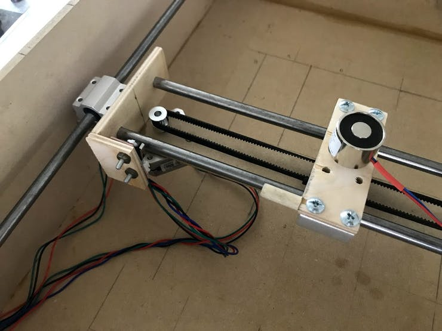

# 8/8: Smart Chess Board

As my minor project for my Computer Engineering course I and my teammate, Piyush decided to build an Automated AI chess board with [Raspberry Pi](https://www.raspberrypi.org/).

### Motivation

The **8/8** aims to move the pieces in resemblance to the movie Harry Potter. We wanted to build an affordable but fully functional project. While not having fancy way of killing pieces, but still, a cool project nevertheless.

## Hardware Design Notes

### Core XY Motion

The 8x8 matrix of the board can house any of the 32 pieces. We needed a mechanism which will let the piece move at any given point on the board. After a lot of thought we decided that the movement, we wish to make is very similar to the motion a 3D printer makes while printing so we decided to dive in deeper into 3D printer axes (plotters) internal workings. After reading a ton, we decided that we will use two lead screw mechanism to make movements in the XY direction one on top of the lead screws that would be the intersection point of the lead screws will be the electromagnet which will make the pieces move.

	
	<i>XY Table - Top View</i>

### Electromagnetic Clamp Head

We decided to move the chess pieces with the electromagnetic head. Each chess piece will have magnetic bottoms and the electromagnet at the top of the lead screw is controlled with the Raspberry Pi and using the force of magnetic attraction we move the board pieces.

	
	<i>Electromagnet Mounting on XY Table</i>

### Stepper Motors

We used two Nema-17 Motors. We tried a lot of motor drivers but, none of the motor driver were reliable, we either burnt the driver or didn't recieve a good one. So we decided to use L298n instead. Using the H-bridge we wrote a simple code to rotate the motor and after a few tests we concluded that five complete rotations of the motor were equal to the movement of one square of the board.

	
	<i>X Axis Motor</i>

	
	<i>Y Axis Motor</i>

## Parts List

The [Master Parts List](parts_list/master_parts_list_raw.csv) contains all the parts necessary to build the entirety of the project as it is listed in our documentation.

### Moving Pieces

Our agent predicts the move and returns the move in a 2-d coordinante system. If our agent predicts a move from (0,0) to (5,6), the motor first rotates 5 x `scale_x` times in the X direction and a total of 6 x `scale_y` steps in the Y direction, where `scale_x` and `scale_y` being the number of rotations required to traverse half the square.

### Avoiding Collision

To prevent the pieces from collision and preventing us to rewrite the whole codebase, we came up with a solution wherein we move the pieces through the borders postulating the pieces will not collide into other pieces if they will move by the border.

## The Chess Engine

The Chess Engine for the game was fairly simple. Each of the pieces of the game was assigned a score.

| Piece  | Score |
|--------|-------|
| King   | 100   |
| Queen  | 9     |
| Rook   | 5     |
| Bishop | 3     |
| Knight | 3     |
| Pawn   | 1     |

The goal of our algorithm is to try to minimize the total score of the opponent and try to maximize its own score. Keeping the next two moves in mind (more than two moves will perform better, but the algorithm will be really slow) we generate a move tree. After the applying min-max algorithm on the move tree an array of best possible moves is generated and the best prediction is predicted out of all the possibilities.

## Maintainers

| [ <b>Vidhyanshu Jain</b>](https://github.com/vidu171) | [ <b>Piyush Raj</b>](https://github.com/0x48piraj) |
| :---: | :---: |